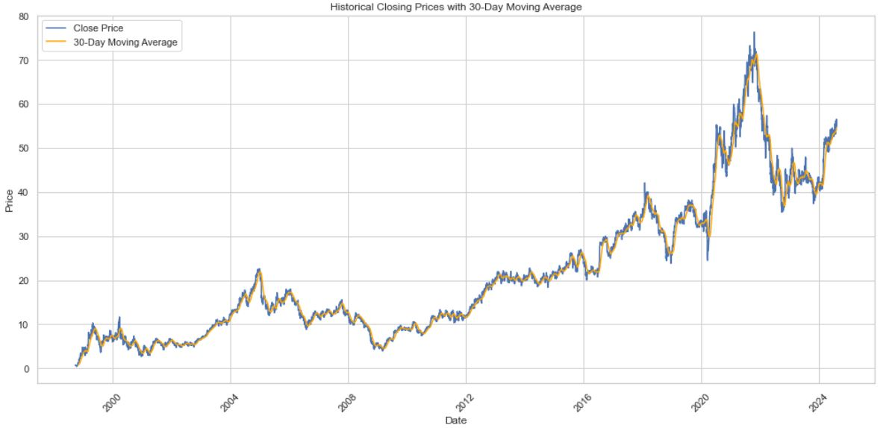

<h1 style="text-align:center; color: #2E86C1;">Optimizing eBay Sales with Predictive Analytics</h1>
<h3 style="text-align:center; color: #D35400;">Analyzing Trends and Forecasting Future Performance!</h3>

  

## Business Understanding

### Business Problem

In the fast-paced and highly competitive world of eCommerce, precise sales forecasting is essential for operational success and strategic planning. As a leading online marketplace, eBay faces the challenge of accurately predicting sales amidst fluctuating demand influenced by a multitude of factors such as seasonal trends, promotional activities, market dynamics, and broader economic conditions. Inaccurate sales predictions can lead to a range of business issues, including suboptimal inventory levels, ineffective marketing strategies, misallocated resources, and flawed financial forecasts.

### Key Challenges

1. **Sales Fluctuations:** Variations in sales due to external and internal factors can impact business operations and financial outcomes.
2. **Resource Allocation:** Inaccurate predictions lead to inefficient use of resources across the organization, affecting inventory management, marketing efforts, and financial planning.
3. **Decision-Making:** Poor sales forecasts can result in misguided decisions, affecting eBay's competitiveness and market positioning.

### Impact on Stakeholders

- **Executive Leadership (eBay C-Suite):** Needs accurate sales forecasts to guide strategic decisions, optimize resource allocation, and strengthen market positioning.
- **Inventory Management Team:** Relies on predictions to maintain optimal stock levels, reducing the risk of stockouts or excess inventory that can result in lost sales or increased holding costs.
- **Marketing Team:** Uses sales forecasts to time marketing campaigns effectively, ensuring budget allocation is focused on high-impact opportunities.
- **Finance Department:** Depends on reliable sales predictions for accurate revenue projections, crucial for planning and aligning financial expectations with business performance.
- **Investors:** Evaluates sales forecasts to assess eBay's future performance, influencing their investment decisions and perceptions of the company's market value.

### Project Objectives

The primary objective of this project is to develop a robust predictive model that accurately forecasts eBay sales. This model will aid in enhancing inventory management, refining marketing strategies, and optimizing financial planning, thereby enabling eBay to make well-informed business decisions.

#### Specific Goals

- **Predictive Accuracy:** Create a model that delivers highly accurate sales forecasts on a weekly or monthly basis.
- **Inventory Optimization:** Demonstrate the model's application in minimizing stockouts and overstocks.
- **Marketing Insights:** Identify trends that allow for targeted and effective marketing campaigns.

### Success Metrics

The success of the predictive model will be evaluated using the following metrics:

- **Mean Absolute Error (MAE):** Measures the average magnitude of errors in the predictions, providing insight into the model's accuracy.
- **Mean Squared Error (MSE):** Highlights the variance in prediction errors, emphasizing larger errors.
- **Root Mean Squared Error (RMSE):** Offers a standard deviation measure of prediction errors, providing a comprehensive view of accuracy.
- **Mean Absolute Percentage Error (MAPE):** Evaluates prediction accuracy as a percentage, enabling easier comparison across different scales.

By addressing these challenges and meeting the project objectives, eBay aims to enhance its operational efficiency and strategic decision-making, thereby maintaining its competitive edge in the eCommerce industry.

## Data Understanding
### Data Source and Cleaning
The data for this project is sourced from Yahoo Finance using the yfinance API, which provides comprehensive historical stock data.
In the Data Preparation step, we focus on ensuring the dataset is clean, structured, and ready for the modeling phase. This involves handling missing values by either imputing them with appropriate statistics (mean, median, mode) or removing incomplete records, depending on the context. Feature engineering is crucial at this stage to enhance the model's performance. Finally, we split the dataset into training and testing sets, ensuring that the model is evaluated on unseen data to accurately assess its generalization capabilities.

## Explanatory Data Analysis

The closing prices show significant fluctuations, with distinct highs and lows. This indicates that the market has gone through phases of swift variation, potentially driven by different economic influences or occurrences.

The trend component indicates a general upward trajectory in stock closing prices over time. The seasonality component reveals regular, repeating patterns in the data, with consistent peaks and troughs occurring at specific intervals, often annually. These recurring fluctuations suggest strong seasonal influences on the stock prices. Meanwhile, the residual component represents the irregular variations that remain after accounting for both trend and seasonality. Notably, there is increased volatility in the residuals around 2020, likely reflecting unexpected market events or disruptions during that period.

## Modelling and Evaluation

The Prophet model performs best based on the provided metrics:

It has the lowest MAE, indicating smaller average errors. It has the lowest MSE and RMSE, showing better overall accuracy and less impact from large errors. In summary, the Prophet model is the most accurate among the three models for this dataset.

## Summary
This analysis employed three distinct time series forecasting models—ARIMA, Prophet, and SARIMA—to predict future closing prices. The models were assessed using performance metrics such as MAE, MSE, and RMSE. Prophet outperformed the others, especially in terms of MAE and RMSE, indicating higher accuracy in its predictions. While the ARIMA model effectively captured linear trends, it struggled with the seasonality and irregularities in the data. SARIMA, which accounts for seasonality, performed better than ARIMA but was still outperformed by Prophet. Overall, the Prophet model was the most effective at capturing both trends and seasonal patterns, making it the most suitable for this dataset.

